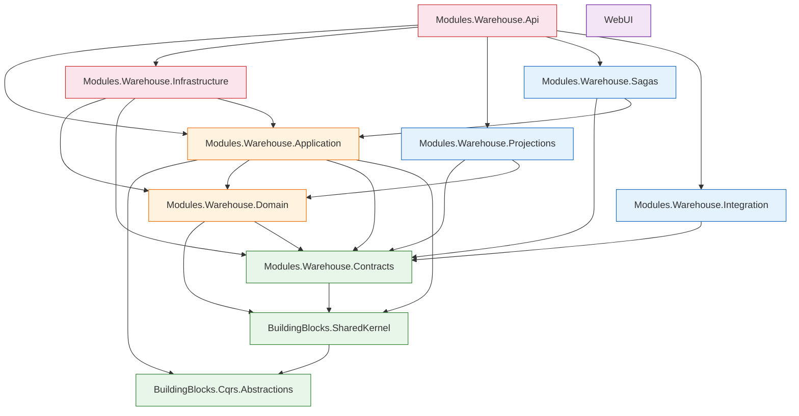

# Dependency Map — LKvitai.MES

> Generated: 2026-02-21
> Method: csproj parsing, ripgrep namespace scan, manual CI/Docker inspection
> Scope: 11 source projects, 5 test projects, 2 Dockerfiles, 3 GH Actions workflows

---

## 1. Project Reference Graph

### 1.1 Reference Table (source projects only)

| # | Project | References | Incoming (depended on by) |
|---|---------|------------|---------------------------|
| 1 | **BuildingBlocks.Cqrs.Abstractions** | _(none — leaf)_ | BuildingBlocks.SharedKernel, Modules.Warehouse.Application |
| 2 | **BuildingBlocks.SharedKernel** | BuildingBlocks.Cqrs.Abstractions | Modules.Warehouse.Contracts, Modules.Warehouse.Domain, Modules.Warehouse.Application, Modules.Warehouse.Integration |
| 3 | **Modules.Warehouse.Contracts** | BuildingBlocks.SharedKernel | Modules.Warehouse.Domain, Modules.Warehouse.Application, Modules.Warehouse.Infrastructure, Modules.Warehouse.Integration, Modules.Warehouse.Projections, Modules.Warehouse.Sagas |
| 4 | **Modules.Warehouse.Domain** | BuildingBlocks.SharedKernel, Modules.Warehouse.Contracts | Modules.Warehouse.Application, Modules.Warehouse.Infrastructure, Modules.Warehouse.Projections, Tests.Warehouse.* |
| 5 | **Modules.Warehouse.Application** | BuildingBlocks.Cqrs.Abstractions, BuildingBlocks.SharedKernel, Modules.Warehouse.Domain, Modules.Warehouse.Contracts | Modules.Warehouse.Infrastructure, Modules.Warehouse.Sagas, Modules.Warehouse.Api, Tests.Warehouse.* |
| 6 | **Modules.Warehouse.Infrastructure** | Modules.Warehouse.Domain, Modules.Warehouse.Contracts, Modules.Warehouse.Application | Modules.Warehouse.Api, Tests.Warehouse.Integration, Tests.Warehouse.Unit |
| 7 | **Modules.Warehouse.Integration** | BuildingBlocks.SharedKernel, Modules.Warehouse.Contracts | Modules.Warehouse.Api |
| 8 | **Modules.Warehouse.Projections** | Modules.Warehouse.Contracts, Modules.Warehouse.Domain | Modules.Warehouse.Api, Tests.Warehouse.Integration, Tests.Warehouse.Unit |
| 9 | **Modules.Warehouse.Sagas** | Modules.Warehouse.Contracts, Modules.Warehouse.Application | Modules.Warehouse.Api, Tests.Warehouse.Unit |
| 10 | **Modules.Warehouse.Api** | Modules.Warehouse.Application, Modules.Warehouse.Infrastructure, Modules.Warehouse.Projections, Modules.Warehouse.Sagas, Modules.Warehouse.Integration | Tests.Warehouse.Integration, Tests.Warehouse.Unit |
| 11 | **WebUI** | _(none — standalone)_ | Tests.Warehouse.Unit |

### 1.2 Test Projects

| Project | References |
|---------|------------|
| Tests.Warehouse.Integration | Modules.Warehouse.Api, Modules.Warehouse.Infrastructure, Modules.Warehouse.Projections, Modules.Warehouse.Domain, Modules.Warehouse.Application, Modules.Warehouse.Contracts |
| Tests.Warehouse.Property | Modules.Warehouse.Domain, Modules.Warehouse.Application |
| Tests.Warehouse.Unit | Modules.Warehouse.Domain, Modules.Warehouse.Application, Modules.Warehouse.Contracts, Modules.Warehouse.Projections, Modules.Warehouse.Infrastructure, Modules.Warehouse.Sagas, Modules.Warehouse.Api, WebUI |
| Tests.Warehouse.E2E | _(black-box, no direct project references)_ |
| ArchitectureTests | _(rule-based static architecture checks)_ |

### 1.3 Mermaid Dependency Graph



**Legend:** Green = leaf/shared, Orange = core domain, Red = high fan-in/coupling, Blue = cross-cutting, Purple = standalone.

---

## 2. NuGet Package Hotspots

### 2.1 Key Packages by Project

| Project | Marten | MassTransit | EF Core | ASP.NET / Web | Logging / Telemetry | Other Notable |
|---------|--------|-------------|---------|---------------|---------------------|---------------|
| **BuildingBlocks.SharedKernel** | — | — | — | — | — | MediatR 12.2.0 |
| **Modules.Warehouse.Contracts** | — | — | — | — | — | _(none)_ |
| **Modules.Warehouse.Domain** | — | — | — | — | — | _(none)_ |
| **Modules.Warehouse.Application** | **Marten 7.0.0** | — | — | — | Logging.Abstractions 8.0.0 | MediatR 12.2.0, FluentValidation 11.9.0 |
| **Modules.Warehouse.Infrastructure** | **Marten 7.0.0** | — | **EF Core 8.0.13**, Npgsql.EFCore.PG 8.0.11, EFCore.BulkExtensions 8.1.3 | — | Serilog 3.1.1 + Console + File | ClosedXML 0.104.2 |
| **Modules.Warehouse.Integration** | — | — | — | — | — | _(none)_ |
| **Modules.Warehouse.Projections** | **Marten 7.0.0** | — | — | — | — | — |
| **Modules.Warehouse.Sagas** | — | **MassTransit 8.1.3**, MassTransit.Marten 8.1.3 | — | — | — | — |
| **Modules.Warehouse.Api** | — | **MassTransit 8.1.3**, MassTransit.RabbitMQ 8.1.3 | — | Swashbuckle 6.5.0, Sdk.Web | Serilog.AspNetCore 8.0.0, OpenTelemetry (4 pkgs) | Hangfire (3 pkgs), CsvHelper, SSH.NET, Polly, Otp.NET, QRCoder |
| **WebUI** | — | — | — | Sdk.Web | — | _(none)_ |

### 2.2 BuildingBlocks Candidates (shared infra packages)

| Package | Used In | Candidate For |
|---------|---------|---------------|
| **Marten 7.0.0** | Modules.Warehouse.Application, Modules.Warehouse.Infrastructure, Modules.Warehouse.Projections | `BuildingBlocks.EventSourcing` — event store abstraction |
| **MassTransit 8.1.3** | Modules.Warehouse.Api, Modules.Warehouse.Sagas, Tests.Warehouse.Unit | `BuildingBlocks.Messaging` — bus + saga runtime |
| **MediatR 12.2.0** | BuildingBlocks.SharedKernel, Modules.Warehouse.Application | Already in SharedKernel; could stay there |
| **FluentValidation 11.9.0** | Modules.Warehouse.Application | `BuildingBlocks.Validation` or keep in Application |
| **Serilog** | Modules.Warehouse.Api, Modules.Warehouse.Infrastructure | `BuildingBlocks.Observability` |
| **OpenTelemetry** | Modules.Warehouse.Api (4 packages) | `BuildingBlocks.Observability` |
| **Hangfire** | Modules.Warehouse.Api (3 packages) | `BuildingBlocks.Jobs` or Infrastructure |
| **EF Core 8.0.13** | Modules.Warehouse.Infrastructure only | Stays in Infrastructure (state-based persistence) |

---

## 3. Namespace / Folder Coupling Scan

### 3.1 Domain-Area Keyword Distribution

| Keyword | Found In Projects | Assessment |
|---------|------------------|------------|
| **StockLedger** | Domain.Aggregates, Application.Commands, Contracts.Events, Projections, Infrastructure | Expected — core aggregate |
| **Reservation** | Domain.Aggregates, Application.Commands, Contracts.Events, Projections | Expected — core aggregate |
| **HandlingUnit** | Domain.Aggregates, Application.Commands, Contracts.Events, Projections, Infrastructure, Api.Services | Expected, but alias conflicts in Infrastructure |
| **Valuation** | Domain.Aggregates, Application.Commands, Api.Services (709 LOC combined) | Api.Services has business logic that belongs in Application |
| **Orders/SalesOrder** | Domain.Entities, Api.Services (523 LOC), Api.Controllers | **Leaking** — order management lives in Api layer |
| **OutboundOrder** | Domain.Entities, Api.Services (241 LOC), Api.Controllers | **Leaking** — same as above |
| **Shipment/Delivery** | Domain.Entities, Api.Services, Api.Controllers (DispatchController) | **Leaking** — dispatch/shipping logic in Api layer |
| **Transfer** | Domain.Entities, Api.Services, Application.Commands | Split between Api.Services and Application |
| **CycleCount** | Domain.Entities, Api.Services, Application.Commands | Split between layers |
| **Agnum** | Domain.Entities (config), Api.Services, Api.Controllers, Integration.Agnum | Integration config mixed into Domain.Entities |
| **LabelPrinting** | Api.Services, Integration.LabelPrinting | **Clean** — adapter properly isolated |
| **Audit** | Domain.Entities (SecurityAuditLog, ElectronicSignature) | Mixed with master data entities |
| **Reporting** | Api.Services (ComplianceReportService) | In Api layer, not Application |
| **Quality** | Domain.Entities (via CycleCount + QC flows) | No separate module |
| Shopfloor, BoM, Scheduler, Measurement, DSAS, Installation, LabelScanning | **Not found** | Future scope — not yet implemented |

### 3.2 Critical Coupling Issues

**Issue 1: God Object — `Domain/Entities/MasterDataEntities.cs`**
- Single file (~1400 LOC) containing **50+ entity classes** spanning 8+ bounded contexts
- Includes: Items, Customers, Suppliers, SalesOrders, OutboundOrders, Shipments, Transfers, CycleCounts, AgnumConfig, Locations, Roles, Permissions, ApiKeys, SecurityAuditLog, ComplianceReport, ElectronicSignature
- **Risk:** Any module split will require decomposing this file first

**Issue 2: Api.Services — 34 files with domain logic**
- Business logic that should be in Application layer sits in Api.Services
- Key files: `SalesOrderCommandHandlers.cs` (523 LOC), `ValuationLifecycleCommandHandlers.cs` (505 LOC), `OutboundOrderCommandHandlers.cs` (241 LOC)
- Handlers in Api directly use `WarehouseDbContext` instead of going through Application commands

**Issue 3: Controllers bypass Application layer**
- `OutboundOrdersController`, `DispatchController`, `ReportsController` query `WarehouseDbContext` directly
- No repository abstraction between Controllers and persistence

**Issue 4: Type alias conflicts**
- `Modules/Warehouse/LKvitai.MES.Modules.Warehouse.Infrastructure/Persistence/WarehouseDbContext.cs` uses type aliases:
  ```csharp
  using WarehouseLayoutAggregate = LKvitai.MES.Modules.Warehouse.Domain.Aggregates.WarehouseLayout;
  using WarehouseLayoutEntity = LKvitai.MES.Modules.Warehouse.Domain.Entities.WarehouseLayout;
  using HandlingUnitAggregate = LKvitai.MES.Modules.Warehouse.Domain.Aggregates.HandlingUnit;
  ```
- Indicates naming collisions between Aggregates and Entities — will complicate module extraction

**Issue 5: Projections → StockLedger internals**
- Projections parse `StockLedgerStreamId` directly, coupling to aggregate implementation details

---

## 4. Circular Dependency Risk Check

### 4.1 Current Cycles in csproj Graph

**None detected.** The project reference graph is a valid DAG (directed acyclic graph).

Dependency layers (topological order):
```
Layer 0: BuildingBlocks.Cqrs.Abstractions, WebUI (leaves)
Layer 1: BuildingBlocks.SharedKernel
Layer 2: Modules.Warehouse.Contracts
Layer 3: Modules.Warehouse.Domain, Modules.Warehouse.Integration
Layer 4: Modules.Warehouse.Application, Modules.Warehouse.Projections
Layer 5: Modules.Warehouse.Infrastructure, Modules.Warehouse.Sagas
Layer 6: Modules.Warehouse.Api
```

### 4.2 Likely Cycles After Modularization

| Risk | Pattern | Concrete Example |
|------|---------|-----------------|
| **HIGH** | Domain.Entities ↔ multiple BCs | `MasterDataEntities.cs` has SalesOrder referencing Item, OutboundOrder referencing Customer — splitting into modules would create circular entity refs |
| **HIGH** | Api.Services ↔ Application | `SalesOrderCommandHandlers.cs` (Api) uses both `Application.Commands` types and `Infrastructure.WarehouseDbContext` — moving to Application would create Application → Infrastructure cycle |
| **MEDIUM** | Infrastructure → Application | `Modules.Warehouse.Infrastructure.csproj` depends on `Modules.Warehouse.Application.csproj` — if Application ever needs an Infrastructure interface impl, the cycle is immediate |
| **MEDIUM** | Projections → Domain.Aggregates | Projections use `StockLedgerStreamId.Parse()` from Domain — if projections move per-module, each module's projections would need Domain access |
| **LOW** | Sagas → Application | Sagas reference `Application.Orchestration` — clean if orchestration interfaces stay in Contracts |

### 4.3 Mitigation Notes

- The Infrastructure → Application dependency is the biggest structural risk. Standard clean architecture has this inverted (Application defines interfaces, Infrastructure implements them). Currently Infrastructure imports Application directly.
- The `MasterDataEntities.cs` god object must be decomposed **before** any module extraction — it's the single biggest coupling point.

---

## 5. CI / Docker Path Coupling

### 5.1 Dockerfiles

**`src/Modules/Warehouse/LKvitai.MES.Modules.Warehouse.Api/Dockerfile`** — hardcodes paths to module/building-block projects:
```dockerfile
COPY src/Modules/Warehouse/LKvitai.MES.Modules.Warehouse.Api/LKvitai.MES.Modules.Warehouse.Api.csproj Modules/Warehouse/LKvitai.MES.Modules.Warehouse.Api/
COPY src/Modules/Warehouse/LKvitai.MES.Modules.Warehouse.Application/LKvitai.MES.Modules.Warehouse.Application.csproj Modules/Warehouse/LKvitai.MES.Modules.Warehouse.Application/
COPY src/Modules/Warehouse/LKvitai.MES.Modules.Warehouse.Infrastructure/LKvitai.MES.Modules.Warehouse.Infrastructure.csproj Modules/Warehouse/LKvitai.MES.Modules.Warehouse.Infrastructure/
COPY src/Modules/Warehouse/LKvitai.MES.Modules.Warehouse.Projections/LKvitai.MES.Modules.Warehouse.Projections.csproj Modules/Warehouse/LKvitai.MES.Modules.Warehouse.Projections/
COPY src/Modules/Warehouse/LKvitai.MES.Modules.Warehouse.Sagas/LKvitai.MES.Modules.Warehouse.Sagas.csproj Modules/Warehouse/LKvitai.MES.Modules.Warehouse.Sagas/
COPY src/Modules/Warehouse/LKvitai.MES.Modules.Warehouse.Integration/LKvitai.MES.Modules.Warehouse.Integration.csproj Modules/Warehouse/LKvitai.MES.Modules.Warehouse.Integration/
COPY src/Modules/Warehouse/LKvitai.MES.Modules.Warehouse.Domain/LKvitai.MES.Modules.Warehouse.Domain.csproj Modules/Warehouse/LKvitai.MES.Modules.Warehouse.Domain/
COPY src/Modules/Warehouse/LKvitai.MES.Modules.Warehouse.Contracts/LKvitai.MES.Modules.Warehouse.Contracts.csproj Modules/Warehouse/LKvitai.MES.Modules.Warehouse.Contracts/
COPY src/BuildingBlocks/LKvitai.MES.BuildingBlocks.SharedKernel/LKvitai.MES.BuildingBlocks.SharedKernel.csproj BuildingBlocks/LKvitai.MES.BuildingBlocks.SharedKernel/
COPY src/BuildingBlocks/LKvitai.MES.BuildingBlocks.Cqrs.Abstractions/LKvitai.MES.BuildingBlocks.Cqrs.Abstractions.csproj BuildingBlocks/LKvitai.MES.BuildingBlocks.Cqrs.Abstractions/
```
- Uses `src/` prefix (repo-root context) — every new project requires Dockerfile update
- Also copies the `.sln` file: `COPY src/LKvitai.MES.sln .`

**`src/Modules/Warehouse/LKvitai.MES.WebUI/Dockerfile`** — standalone, only copies WebUI project. No coupling.

### 5.2 GitHub Actions

**`.github/workflows/build-and-push.yml`**
- References Dockerfiles by path: `src/Modules/Warehouse/LKvitai.MES.Modules.Warehouse.Api/Dockerfile`, `src/Modules/Warehouse/LKvitai.MES.WebUI/Dockerfile`
- Build context is repo root (`.`) — correct

**`.github/workflows/deploy.yml`**
- Hardcodes test project path: `tests/Modules/Warehouse/LKvitai.MES.Tests.Warehouse.Integration/LKvitai.MES.Tests.Warehouse.Integration.csproj`
- Hardcodes specific test filter by `FullyQualifiedName~` (6 test class names)
- References script: `scripts/validate-schema.sh`

### 5.3 Scripts

| Script | Path References |
|--------|----------------|
| `scripts/validate-schema.sh` | No project paths — uses DB connection only |
| `scripts/master-data-operational-smoke.sh` | No project paths — uses API URLs only |
| `scripts/seed-master-data.sql` | No project paths — SQL only |

### 5.4 Docker Compose

**`src/docker-compose.yml`** — infrastructure only (postgres, rabbitmq, jaeger). No project path references.

### 5.5 Path Coupling Summary

| File | Coupling Level | Notes |
|------|---------------|-------|
| Modules.Warehouse.Api/Dockerfile | **HIGH** — hardcoded project paths | Must update on every project add/rename |
| WebUI/Dockerfile | LOW — self-contained | No coupling |
| build-and-push.yml | LOW — only Dockerfile paths | Stable |
| deploy.yml | **MEDIUM** — hardcoded test csproj + test names | Fragile if tests move |
| docker-compose.yml | NONE | Infrastructure only |
| scripts/* | NONE | API/DB only |

---

## 6. Summary of Findings

1. **No circular dependencies** exist at the csproj level — the graph is a clean DAG
2. **BuildingBlocks.SharedKernel and Contracts are shared roots** — good foundation for modularization
3. **Infrastructure → Application dependency** inverts clean architecture (Application should define ports, Infrastructure implements them)
4. **`MasterDataEntities.cs` is a god object** (~1400 LOC, 50+ entities, 8+ bounded contexts) — the #1 blocker for module extraction
5. **Api.Services layer (34 files)** contains business logic that belongs in Application — this is the #2 structural issue
6. **Marten is used in 3 projects** (Application, Infrastructure, Projections) — candidate for `BuildingBlocks.EventSourcing`
7. **MassTransit is used in 3 projects** (Api, Sagas, Tests.Unit) — candidate for `BuildingBlocks.Messaging`
8. **WebUI is completely isolated** — zero project references, zero NuGet packages beyond Sdk.Web
9. **Api Dockerfile hardcodes 9 project paths** — fragile, must be updated on every project change
10. **Integration project is well-isolated** — depends on Contracts + SharedKernel, good anti-corruption layer pattern
11. **Order/Delivery/Finance domain logic leaks into Api layer** — SalesOrderCommandHandlers (523 LOC), ValuationLifecycleCommandHandlers (505 LOC) live in Api.Services instead of Application
12. **Type alias conflicts** (WarehouseLayout, HandlingUnit) between Aggregates and Entities signal naming collisions that will complicate splitting
