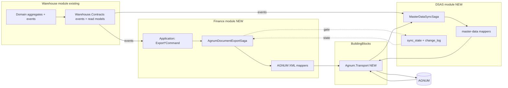
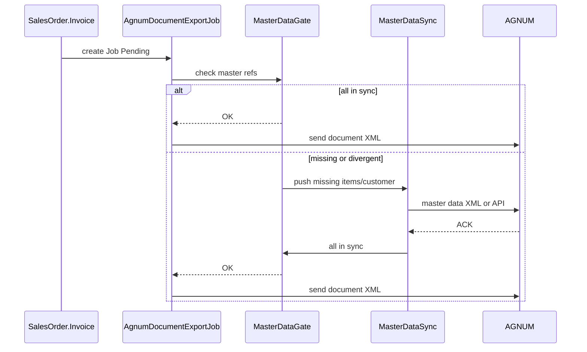

# AGNUM XML Integration — Architecture Draft

> **STATUS: DRAFT** — pre-implementation architectural analysis. Не утверждён, не является basis для написания кода. Требует ответов на критические вопросы §5 и ADR'ов.

> Роль: senior solution architect. Документ содержит факты из репозитория (на момент 2026-04-20), предложения, trade-offs и open questions. Код не пишется до утверждения направления.

## Контекст и уточнения

- **Уточнение 1:** master data = **two-way sync** MES ↔ AGNUM; при отсутствии master data в AGNUM на момент отправки документа — **auto-create** (позже выяснилось — встроен в AGNUM).
- **Уточнение 2:** AGNUM-интеграция — **не Warehouse concern**. По target-декомпозиции модулей задача принадлежит **Finance** (document exports) + **DSAS** (data sync). Warehouse остаётся inventory engine.
- **Фактическое состояние репо:** существует **только** модуль `Warehouse` (8 csproj). Модулей Finance, DSAS, Orders, Delivery, Audit ещё нет — это target-архитектура. Создание новых модулей блокируется tech-debt **ARCH-01** (god object `MasterDataEntities.cs`, ~1400 LOC).
- **Факты про AGNUM-интеграцию (agnum.lt + 3rd-party DokSkenas):**
  - Официально: **XML/XLS/TXT import**, **API integracijos**, интеграции с **I.SAF** и **I.VAZ**, EDISOFT/TELEMA и др.
  - На практике XML-импорт — **UI-workflow**: `Dokumentai → Pajamavimai / Pardavimai → Importavimas iš .XML → Nuskaityti → Patikrinti → Importuoti`. Continuous programmatic API для document-push из коробки публично не задокументирован.
  - **AGNUM АВТОМАТИЧЕСКИ создаёт карточки товаров и контрагентов при импорте документа** (цитата DokSkenas: *"Importavus duomenis prekių, paslaugų bei kontrahentų kortelės automatiškai susikurs Agnum programoje"*). Snimaet master-data push MES→AGNUM как блокирующее требование.
  - **Stub auto-create vs полноценная карточка:** auto-create заполняет только то, что в XML (name, code, barcode, VAT). Account, Department, Accounting group остаются пустыми — бухгалтер докручивает вручную.
  - Партнёры (DokSkenas) подтягивают коды товаров **из** AGNUM → AGNUM→MES master-data pull архитектурно существует (форма неизвестна).
  - Deployment: локальная / терминальная / **SaaS** — последнее исключает direct DB access.
- **Следствие для v27 "pardavimo + VAZ":** скорее всего (a) внутренний AGNUM-формат, который AGNUM потом сам отправляет в I.VAZ, либо (b) стандартный I.VAZ-формат — тогда MES может идти в I.VAZ напрямую, минуя AGNUM (см. Q-IVAZ-1).

---

## 1. Summary текущей ситуации

### Что уже есть (подтверждено чтением кода)

- **AGNUM export сегодня — только inventory snapshot:**
  - Оркестратор: [`src/Modules/Warehouse/LKvitai.MES.Modules.Warehouse.Api/Services/AgnumExportServices.cs`](../../src/Modules/Warehouse/LKvitai.MES.Modules.Warehouse.Api/Services/AgnumExportServices.cs) — `AgnumExportOrchestrator`, строит CSV (через `CsvHelper`) и опционально POST'ит JSON на `{ApiEndpoint}/api/v1/inventory/import`.
  - Колонки CSV: `ExportDate, AccountCode, SKU, ItemName, Quantity, UnitCost, OnHandValue`. Источник — EF-проекция `OnHandValue` + fallback к `AvailableStockView` (Marten).
  - Сага: [`AgnumExportSaga.cs`](../../src/Modules/Warehouse/LKvitai.MES.Modules.Warehouse.Sagas/AgnumExportSaga.cs) (Processing → Completed/Failed, 3 retry).
  - Hangfire: `agnum-daily-export`, cron `0 23 * * *`.
  - История: таблица `agnum_export_history` (entity `AgnumExportHistory`).
  - Конфиг: `AgnumExportConfig` + `AgnumMapping` (`SourceType`/`SourceValue` → `AgnumAccountCode`) — account-bucket mapping.
  - Feature flag `enable_agnum_export` + rollout percent.
  - API: [`AgnumController.cs`](../../src/Modules/Warehouse/LKvitai.MES.Modules.Warehouse.Api/Api/Controllers/AgnumController.cs) (конфиг, ручной запуск, history, reconciliation).
  - Reconciliation: in-memory store (**НЕ персистентно**).

- **Integration слой почти пуст:** [`src/Modules/Warehouse/LKvitai.MES.Modules.Warehouse.Integration/Agnum/IAgnumExportService.cs`](../../src/Modules/Warehouse/LKvitai.MES.Modules.Warehouse.Integration/Agnum/IAgnumExportService.cs) — blueprint-порт без реализации и без DI-регистрации. Реальная логика живёт в `Api/Services` (нарушение ACL).

- **Outbox:** класс `OutboxMessage` и `OutboxProcessor` заведены, но `ProcessOutboxMessages` — **заглушка**. Реальный транспорт событий — MassTransit `IEventBus` напрямую.

- **XML сериализации в проекте нет вообще** (кроме `XDocument` в DependencyValidator / ArchitectureTests). Ни `XmlSerializer`, ни `DataContractSerializer`, ни XSD-схем.

- **Доменные документы, релевантные AGNUM:**
  - Приход: `InboundShipment` / `InboundShipmentLine` (EF) + `ReceiveGoodsCommand` (Marten ledger).
  - Продажа: `SalesOrder` / `SalesOrderLine` + `OutboundOrder` + `Shipment`. Статус `Invoiced` существует, но отдельной `Invoice`-сущности **НЕТ**.
  - Списание: нет отдельной `WriteOff`-сущности. Есть `Valuation.WriteDown` (event-sourced) + `RecordStockMovement(reason=WRITEOFF)` + `AdjustmentReasonCode`. Scrap-переводы: `Transfer.ToWarehouse == "SCRAP"` (строковая convention).

### Что принципиально отсутствует

- **XML-producer/consumer** для AGNUM (все 3 спецификации).
- **Document-level AGNUM export** (приход/продажа/списание — сейчас выгружается только снапшот остатков).
- **Master data для корректного XML:** VAT-ставки, налоговые ID контрагентов (customer/supplier без `CompanyCode`/`VATCode`), Departments, Objects (cost centers / dimensions), полноценный chart of accounts (только строка `AgnumAccountCode`), транспортные реквизиты (`TransportDocument`/VAZ).
- **Invoice как сущность** (номер, серия, дата выписки, налоговые колонки).
- **Персистентная reconciliation и error/validation store.**

---

## 2. Proposed Architecture (module split Finance + DSAS)

### 2.1 Module ownership

- **Finance** (NEW) — владеет AGNUM document export pipeline (XML v25 / v27 / v4), financial posting events, recon с бухгалтерией, XML-contracts и XSD-схемами документов. Никакой inventory-логики не содержит.
- **DSAS** (NEW) — владеет master-data two-way sync MES ↔ AGNUM (и другими внешними системами: AIVA, measurement tools). Хранит sync-state, conflict resolution, change detection, ETL. Не владеет доменом справочников, но координирует синхронизацию.
- **Warehouse** (existing) — остаётся inventory engine. Эмитит события (`SalesOrderInvoicedEvent`, `GoodsReceivedEvent`, `StockWrittenDownEvent`, `ItemCreated`/`Updated`, `CustomerCreated`/`Updated` и т.д.) в `Warehouse.Contracts`. **НЕ знает про AGNUM.**
- **Audit** (future) — принимает события всех модулей (`AgnumDocumentExportSucceeded`, `MasterDataSynced`, `MasterDataConflict`). Не реализуем в рамках этой задачи — только предполагаем контракт.
- **Orders / Delivery / Installation / BoM / Shopfloor / Quality / Reporting / LabelPrinting / LabelScanning / Infra** — не в scope. `Customer` по логике ближе к **Orders**, а не Warehouse (миграция — отдельная задача).

### 2.2 Target module layout

```
src/Modules/
  Warehouse/                                  # existing — только исходит события
  Finance/                                    # NEW
    LKvitai.MES.Modules.Finance.Api/
    LKvitai.MES.Modules.Finance.Application/  # Export*Command, ports
    LKvitai.MES.Modules.Finance.Contracts/    # Finance integration events
    LKvitai.MES.Modules.Finance.Domain/       # Invoice? COA? Account, Department (if Finance-owned)
    LKvitai.MES.Modules.Finance.Infrastructure/
    LKvitai.MES.Modules.Finance.Integration/
      Agnum/
        Abstractions/      # IAgnumDocumentExporter
        Contracts/
          V25.Purchase/    # pajamavimo v25 XML POCO
          V27.Sales/       # pardavimo + VAZ v27 XML POCO
          V4.WriteOff/     # nurasymo v4 XML POCO
          Shared/          # AgnumData, Documents, Row, TransportDocument
        Mapping/           # MES-events/views -> AGNUM XML
        Serialization/     # XmlSerializer wrapper + XSD validator
        Schemas/           # .xsd embedded resources
        Transport/         # File/SFTP/HTTP sink
    LKvitai.MES.Modules.Finance.Sagas/        # AgnumDocumentExportSaga
    LKvitai.MES.Modules.Finance.WebUI/        # Finance-specific pages
  DSAS/                                       # NEW
    LKvitai.MES.Modules.DSAS.Api/
    LKvitai.MES.Modules.DSAS.Application/     # SyncMasterData*Command, conflict policies
    LKvitai.MES.Modules.DSAS.Contracts/       # MasterDataSyncRequested/Completed/ConflictDetected
    LKvitai.MES.Modules.DSAS.Domain/          # SyncState aggregate, ChangeLog
    LKvitai.MES.Modules.DSAS.Infrastructure/  # sync_state table, change_log table
    LKvitai.MES.Modules.DSAS.Integration/
      Agnum/
        MasterData/        # item/customer/supplier/account master-data XML (или API) mappers
        Abstractions/
        Transport/
      Aiva/                # future
    LKvitai.MES.Modules.DSAS.Sagas/
    LKvitai.MES.Modules.DSAS.WebUI/           # Sync dashboard, conflict resolution UI
  BuildingBlocks/
    LKvitai.MES.BuildingBlocks.Agnum.Transport/  # NEW: общий HTTP/SFTP client + auth
```

**Dependency rules** (по аналогии с существующими для Warehouse):
- Finance и DSAS зависят от `BuildingBlocks.*` и `Warehouse.Contracts` (read-only потребление событий).
- Finance и DSAS **не зависят** от `Warehouse.Domain/Infrastructure` напрямую.
- Никаких cross-module direct DB join'ов — только events + read-model API.

### 2.3 Пересечение Finance ↔ DSAS

Две зоны, где границы неочевидны — требуют ADR:

1. **Accounts / Departments / Objects master data.** По логике должны быть в DSAS (sync MES↔AGNUM). Но они также семантически — financial dimensions, т.е. домен Finance. **Компромисс:** Finance владеет доменной моделью (`Account`, `Department`, `Object` aggregate в Finance.Domain), DSAS координирует sync (использует Finance.Contracts + Finance.Application API).
2. **AGNUM transport** (SFTP / HTTP sink) — общий у Finance (документы) и DSAS (master data). Варианты: (a) общий BuildingBlock, (b) дублировать, (c) Finance-owned с DSAS через Finance.Contracts. **Рекомендация: (a)** — один аутентификатор, один HttpClient, один error-mapping.

### 2.4 Высокоуровневая схема взаимодействия



Ключевое:
- Finance `AgnumDocumentExportSaga` перед отправкой документа **читает DSAS sync_state** (через published read model / query API). Если master data не в sync → триггерит `EnsureMasterDataSyncedCommand` в DSAS → ждёт event `MasterDataSynced` → продолжает.
- Никакого прямого чтения DSAS из Finance.Infrastructure — только через DSAS-published contracts/API.

### 2.5 Что остаётся внутри Warehouse (НЕ выносим)

- Весь inventory движок (StockLedger, HandlingUnit, Reservation, WarehouseLayout, ValuationLifecycle).
- Items, Locations, Barcodes, UoM, SupplierItemMapping — справочники физически живут в Warehouse, используются доменом Warehouse. **DSAS читает их события** и обеспечивает sync с AGNUM.
- Customer, SalesOrder — сейчас в Warehouse, должны мигрировать в Orders (отдельная задача).

### 2.6 Что выносится существующего в Finance (миграция)

Из текущего `Modules.Warehouse/Api/Services/AgnumExportServices.cs` + `AgnumController.cs` + `AgnumExportSaga.cs` + `agnum_export_*` таблицы + Blazor страницы:
- Переезжают в Finance-модуль.
- `AgnumReconciliationServices.cs` → Finance (recon бухгалтерии = Finance concern).
- `AgnumExportConfig` / `AgnumMapping` / `AgnumExportHistory` → в Finance-схему БД (новая EF-миграция).
- Blazor страницы `/warehouse/agnum/*` → `/finance/agnum/*`.

Альтернатива: оставить старый inventory-snapshot export в Warehouse как есть, а новую XML-интеграцию строить сразу в Finance, и мигрировать позже. См. **Q-MOD-3**.

### 2.7 Ключевые компоненты Finance (document export pipeline)

- **`AgnumDocumentExportJob`** (EF): `Id`, `DocumentType` (Purchase/Sales/WriteOff), `DocumentVersion` (25/27/4), `SourceAggregateId`, `SourceAggregateType`, `BusinessDate`, `Status` (Pending/Building/Validating/Ready/Sent/Acknowledged/Failed/Cancelled), `AttemptCount`, `LastError`, `PayloadHash`, `GeneratedFilePath`, `AcknowledgedAt`, `TriggerType` (Auto/Manual/Replay), `CorrelationId`, `CreatedBy`. Один MES-документ = одна строка = один XML.
- **`AgnumDocumentPayload`** — сохранённый XML + метаданные (размер, схема, SHA-256). Gzip опционально. Нужно для audit, ре-отправки, диспутов с бухгалтерией.
- **`AgnumValidationError`** — строчные ошибки XSD/бизнес-валидации для drill-down в UI.
- **`AgnumDocumentAcknowledgement`** — факт приёма AGNUM'ом (если AGNUM даёт feedback).
- **`IAgnumDocumentExporter`** — port в Finance.Application:
  ```csharp
  Task<AgnumExportResult> BuildAsync(AgnumDocumentKey key, CancellationToken ct);
  Task<AgnumSendResult> SendAsync(Guid jobId, CancellationToken ct);
  ```
- **Idempotency:**
  1. Детерминированный `jobId = hash(documentType + sourceId + version)` — один MES-документ = одна запись.
  2. `payloadHash` — ре-генерация не создаёт новую строку если XML не изменился.
  3. На стороне AGNUM дубликаты фильтруются по внешнему номеру документа (верифицировать).
- **Retries:** Polly на send-стадии + Hangfire exponential backoff (существующий паттерн), dead-letter после N попыток → alert + manual replay из UI.
- **Trigger paths:**
  1. **Event-driven:** `SalesOrderInvoicedEvent` → handler создаёт `AgnumDocumentExportJob(Pending)`.
  2. **Scheduled batch:** Hangfire подбирает все `Pending`, строит/отсылает per-document.
  3. **Manual:** `POST /finance/agnum/documents/{type}/{id}/export` из UI (supervisor).

### 2.8 Разделение AGNUM-contract от MES-модели

- XML-POCO — **отдельные типы** с `XmlRoot`/`XmlElement`/`XmlAttribute` атрибутами, без ссылок на Domain. Живут в `Finance.Integration.Agnum.Contracts.VXX/`.
- Mapper = чистая функция `(MesAggregateView, MasterDataBundle) → AgnumDocumentV25`. Никакого EF/Marten внутри mapper — данные подтягиваются заранее `MasterDataEnricher`.
- Плюсы: юнит-тестируется без DB, смена версии XML не трогает Domain, property tests на XSD-fixtures.

### 2.9 Import-path (future-proof)

Строим симметрично: `IAgnumDocumentImporter` с зеркальным pipeline (XML file → XSD-валидация → parser → mapper → command в MES). Сейчас не реализуем, но контракты и папка `Finance.Integration.Agnum.Import/` резервируются.

### 2.10 Master Data Two-Way Sync (DSAS)

> **Pivot после изучения agnum.lt/DokSkenas:** AGNUM при XML-импорте документа **сам создаёт карточки** незнакомых товаров/контрагентов (stub с минимальными полями). Это значит:
> - **"Push нового товара MES→AGNUM" как блокирующее требование для документа — больше не критично**, происходит автоматически.
> - DSAS нужен для: (1) обогащения карточек полями, которых нет в документе (Account, Department, Accounting Group); (2) инверсного направления AGNUM→MES (бухгалтер создал/отредактировал в AGNUM → MES подхватил); (3) периодической сверки расхождений.
> - DSAS больше **не блокер** для Phase 2 Finance — строится параллельно или позже.

**Sync entities (кандидаты):** `Item`, `Customer`, `Supplier`, `Account`, `Department`, `Object`, `UnitOfMeasure`, `ItemBarcode`, `VATRate`. Per-entity решается в Q-MD-3.

**Компоненты:**
- **`AgnumMasterDataSyncState`** (EF): `EntityType`, `MesEntityId`, `AgnumCode`, `LastPushedHash`, `LastPulledHash`, `LastPushedAt`, `LastPulledAt`, `LastEditDirection`, `Status` (InSync/Divergent/Conflict/Error), `ErrorMessage`.
- **`AgnumMasterDataChangeLog`** (append-only) — каждая попытка push/pull с hash payload.
- **MES→AGNUM outbound (enrichment, опционально):** consumer доменных CRUD-событий → Hangfire push-job → update sync_state. Debounce 30s.
- **AGNUM→MES inbound:** зависит от Q-MD-2 — file export + SFTP pull, API read, или direct-DB read (on-prem only).
- **Initial bootstrap:** one-time full pull AGNUM→MES.
- **Stub enrichment workflow:** бухгалтер в AGNUM докручивает stub-карточку → AGNUM→MES pull подтягивает обогащённые поля. Круг замыкается без отдельного MES-push.
- **UI (DSAS.WebUI):** Sync dashboard, conflicts, retry, force-push.

**Conflict resolution** требует ADR per entity: LWW, MES wins, AGNUM wins, per-field. Рекомендация: гибрид (LWW для Items/Customers, AGNUM-wins для Accounts/Departments).

**Auto-create gate flow:**



> Примечание: после pivot (AGNUM auto-create) этот flow теперь актуален только для документов, где stub-карточки неприемлемы (см. Q-OPS-2).

---

## 3. Gap Analysis (AGNUM XML vs. текущая модель)

> Легенда: [OK] = есть, [PARTIAL] = есть частично, [MISSING] = нет

### 3.1 `AgnumData` / `Documents` / `Row`

- [PARTIAL] Document header: номер/серия/дата — есть у `SalesOrder`/`InboundShipment`, но нет единого "AGNUM-номер документа" (серия + номер). Нужен `AgnumDocumentNumber` generator или `ExternalDocumentNumber` на агрегате.
- [MISSING] Тип операции AGNUM (коды приход/продажа/списание/возврат/сторно) — не map'ится на текущий `MovementType` 1:1.
- [PARTIAL] Строки: `SalesOrderLine.UnitPrice` и `LineAmount` есть; **VAT-суммы и net/gross split — НЕТ вообще**.
- [MISSING] Валюта документа (нет поля `Currency` ни на SO, ни на IS, ни на Item).
- [MISSING] Курс валют на дату документа.

### 3.2 `Customers`

- [PARTIAL] `Customer` имеет: `CustomerCode`, encrypted `Name`, `BillingAddress`, `DefaultShippingAddress`, `PaymentTerms`, `CreditLimit`.
- [MISSING] Налоговый ID / VAT code (`PVM`), `CompanyCode` (ЛТ `Imonės kodas`), классификатор (физ/юр лицо, резидент/нерезидент), ISO код страны.
- [MISSING] AGNUM-specific `CustomerGroupCode` / `DefaultAccount`.

### 3.3 `Goods` (Items)

- [OK] `Item.InternalSKU`, `Name`, `BaseUoM`, `Barcodes`.
- [MISSING] **VAT-ставка по товару** (обязательна для XML). Нет ни поля, ни таблицы.
- [MISSING] AGNUM-код товара (если AGNUM требует собственный код).
- [MISSING] Классификатор (`CN-код`, `Intrastat`, `tariff code`).
- [PARTIAL] Unit of measure: есть `UnitOfMeasure` + `ItemUoMConversion`, но нет map на коды UoM AGNUM (ST, KG, L и т.д.) — нужна mapping table.

### 3.4 `Departments` / `Objects`

- [MISSING] Department — НЕТ в домене совсем.
- [MISSING] Objects (cost centers / dimensions) — НЕТ.
- [PARTIAL] `Warehouse` entity может служить source-of-truth для "Department" — требует ADR.

### 3.5 `Accounts`

- [PARTIAL] Сейчас только string `AgnumAccountCode` в `AgnumMapping`. Это не chart-of-accounts, а bucket-mapping.
- [MISSING] Полноценный COA (hierarchy, тип счёта, debit/credit rules).
- [MISSING] Per-document account resolution (для каждой строки AGNUM Row нужен debit и credit account).

### 3.6 `TransportDocument` / VAZ (v27)

- [PARTIAL] `Shipment` есть: `Carrier`, `TrackingNumber`, `DeliveryAddress`, `ShippedAt`, `DeliveredAt`.
- [MISSING] **VAZ-специфика**: регистрационный номер ТС, водитель (имя + код), трейлер, маршрут, адрес погрузки/разгрузки, объём/вес в правильных единицах.
- [MISSING] Привязка Shipment ↔ AGNUM VAZ-сущность.

### 3.7 `Barcodes`

- [OK] `ItemBarcode` покрывает.
- [PARTIAL] Нет явного map "primary GTIN для AGNUM". Конвенция `Item.PrimaryBarcode` есть, но не типизирована под AGNUM.

### 3.8 Write-off (v4)

- [MISSING] Нет агрегата `WriteOffDocument`. Есть куски: `Valuation.WriteDown`, `RecordStockMovement(reason=WRITEOFF)`, `AdjustmentReasonCode`. Нужно либо явный aggregate, либо AGNUM-документ из view, агрегирующего ledger-события.
- [MISSING] Approval metadata для списания (подпись ответственного, номер приказа).

### 3.9 Cross-cutting

- [MISSING] **Reverse/storno документы** (корректировки, кредит-ноты).
- [MISSING] **Multi-company / multi-tenant**: в MES нет понятия legal entity.
- [MISSING] **Numbering series** для AGNUM (серии + gap-less).

---

## 4. Architecture Options

### Вариант A — Minimal Pragmatic MVP (file-based semi-automated)

**Scope:** MES генерит XML → кладёт на **SFTP / shared folder** → бухгалтер раз в день заходит в AGNUM и нажимает **Importuoti iš XML**. Master-data auto-create опирается на встроенный механизм AGNUM.

- Один тип документа (Sales v27 без VAZ), генератор внутри `Api/Services/` (расширение текущего `AgnumExportOrchestrator`).
- XML-POCO inline, schema-validation базовая (XSD если доступен).
- SFTP sink + daily digest email бухгалтеру "файлы за сегодня готовы, N документов".
- DSAS не строится. Master data sync не делается — полагаемся на AGNUM auto-create.
- Jobs хранятся в существующей `agnum_export_history` с расширением полей (`XmlPayload`, `FilePath`, `ImportedByAccountantAt`).
- Reconciliation — existing CSV-compare остаётся.

**Плюсы:** 2–3 спринта до production, нулевая bureaucracy, использует встроенную AGNUM auto-create, нет проблемы "как нажать Importuoti".
**Минусы:** human-in-the-loop, stub-карточки (account/department пустые), нарушает Integration-ACL, нет проверки "документ попал в AGNUM", не масштабируется на 1000+ документов/день.

### Вариант B — Нормальная расширяемая архитектура (рекомендуется)

**Scope:** все 3 спецификации, proper ACL, персистентный job/payload/validation store, event-driven + scheduled batch, manual replay из UI, XSD-валидация, versioning, Finance + DSAS модули.

- Реализация по §2.
- Новые EF таблицы: `agnum_document_export_jobs`, `agnum_document_payloads`, `agnum_validation_errors`, `agnum_document_acknowledgements`, `agnum_master_data_sync_state`, `agnum_master_data_change_log`.
- Master-data расширения: VAT на Item, tax IDs на Customer/Supplier, Department/Object entities, UoM AGNUM-mapping, опционально Company entity.
- Saga per document с checkpoint'ами.
- Reconciliation — персистентная + дневной отчёт.
- Import-контракты зарезервированы, реализация — Phase 7.

**Плюсы:** выдерживает смену версии XML, testable (pure-function mapper), audit-ready, симметричен для import, соответствует CLAUDE.md.
**Минусы:** 6–10 спринтов; требует ADR'ов по master-data/COA; больше миграций; блокируется ARCH-01.

### Вариант C — Enterprise overkill

- Отдельный модуль `Modules.Accounting` с собственным bounded context (COA, Journal, Postings).
- `Modules.Agnum` как отдельный модуль с собственной БД/схемой.
- Message-broker-first pipeline (Kafka topic per document type).
- XSLT-based mapping (data-driven, без кода per version).
- Full bidirectional sync как equal peers.

**Плюсы:** future-proof для новых ERP-партнёров.
**Минусы:** 12+ спринтов, требует DDD/multi-module expertise, оверкил для одной AGNUM-интеграции, противоречит "modular monolith".

**Рекомендация:** после pivot (AGNUM auto-create + UI-workflow) **вариант A может оказаться достаточным для MVP**. Вариант B — если хочется full automation или stub-карточки неприемлемы. Вариант C — на данный момент преждевременно.

---

## 5. Critical Questions

> Группированы по темам. Номерной стиль (1..40 + Q-*-*) позволяет ссылаться на конкретный вопрос в ответах.

### Business rules
1. Какие из 3 спецификаций обязательны в Phase 1 (приоритет: purchase / sales / write-off)?
2. AGNUM — источник или приёмник? Есть ли сценарии, где документ создаётся в AGNUM и должен появиться в MES?
3. Для каких legal entities (companies) идёт интеграция? Одна или несколько?
4. Поддерживаем ли сторно/коррекции/кредит-ноты в Phase 1?

### Source of truth
5. Источник истины для XML-invoice — `SalesOrder` или нужна отдельная `Invoice` aggregate?
6. Для списания — `Valuation.WriteDown`, `RecordStockMovement(WRITEOFF)`, или новая `WriteOffDocument`?
7. Для прихода — `InboundShipment` (EF) или `ReceiveGoodsCommand`-события (Marten)?

### Document lifecycle
8. Когда триггерится AGNUM-экспорт: сразу после `Invoiced`/`Received`/`WrittenOff`, по расписанию, оба? SLA?
9. Что делать с документами до включения интеграции (backfill)?
10. Можно ли пере-отправлять документ если MES изменил его после экспорта? Immutability policy?

### Master data ownership
11. Откуда берём VAT-ставку: Item, Category, VAT-catalog?
12. Налоговые ID и CompanyCode контрагентов — расширяем Customer/Supplier или отдельная `LegalEntity`?
13. Departments/Objects — это MES Warehouse/Zone, или отдельное измерение?
14. Кто владелец AGNUM account codes — бухгалтерия или MES UI?

### AGNUM mapping rules
15. Есть ли готовые валидные XML-sample для всех 3 спецификаций?
16. Есть XSD-схемы, или только human-readable spec?
17. Для каждой строки AGNUM Row нужен debit/credit account. Правило: по типу движения, категории товара, per warehouse?
18. Map MES UoM на AGNUM UoM-коды (ST, KG, L, M, ...)?

### Numbering / codes
19. Кто присваивает номер документа — MES или AGNUM? Если MES — формат серии?
20. Нумерация gap-less или просто unique?
21. AGNUM-код товара/клиента = MES-коду, или внешний alias?

### Warehouses / objects / departments
22. Виртуальные локации (`SUPPLIER`, `PRODUCTION`, `SCRAP`, `SYSTEM`) — Department/Object или фильтруем?
23. Какой AGNUM Department для трансфера между складами?

### Customers / suppliers / accounts
24. Customer.Name/Address зашифрованы (PII). AGNUM требует plaintext — согласовать decrypt-policy.
25. Есть ли default account per customer/supplier, или account определяется типом документа?
26. Что делать если customer/supplier/item отсутствует в AGNUM — fail-fast, auto-create (работает!), manual?

### Transport / VAZ (v27)
27. Все ли sales-документы имеют VAZ (самовывоз — без)? Признак?
28. Данные водителя и ТС — Shipment (нет полей), carriers API, manual?
29. Адрес погрузки (warehouse address) — где хранится?

### Error handling / reconciliation
30. Что есть "успешный экспорт" — факт доставки файла, ACK, факт проводки?
31. Сколько retry до алерта? Кого алертим?
32. Reconcile — daily count+sum compare? Автоматически или manual?
33. Сколько лет хранить XML? (ЛТ legal — минимум 10).

### Operational workflow
34. Transport: SFTP, HTTP upload, email, REST API?
- **Q-OPS-1.** Кто и когда нажимает "Importuoti iš XML" в AGNUM? (a) Бухгалтер вручную раз в день, (b) AGNUM scheduled pickup из folder, (c) вендорский программный канал, (d) RPA (Power Automate / UiPath). **Блокер для transport layer.**
- **Q-OPS-2.** Приемлемы ли stub-карточки (auto-created с name/code/barcode/VAT), которые бухгалтер докрутит позже? Или требуется полностью заполненная карточка сразу?
- **Q-OPS-3.** Объём документов в день: 10, 100, 1000? Определяет manual vs automation.
35. Кто имеет право ре-отправить/отменить экспорт (`Accountant`, `Supervisor`, `Admin`)?
36. Нужен ли dry-run / preview XML перед отправкой?

### Module structure
- **Q-MOD-1.** Модули Finance и DSAS существуют в другой ветке/репо, или создаём с нуля?
- **Q-MOD-2.** Scope Finance в Phase 1: только AGNUM-document-export, или полный Finance BC (Invoice aggregate, COA, postings)?
- **Q-MOD-3.** Что делать с legacy `AgnumExportServices.cs` / `AgnumController.cs` / `agnum_export_*`: (a) сразу мигрировать, (b) оставить + строить рядом, (c) удалить?
- **Q-MOD-4.** ARCH-01 (god object `MasterDataEntities.cs`) — декомпозировать сейчас (Phase 0.5) или идём "ARCH-01-aware" путём?
- **Q-MOD-5.** Customer сейчас в Warehouse. Миграция в Orders — сейчас, позже, оставить в Warehouse?
- **Q-MOD-6.** AGNUM transport — Finance-owned, DSAS-owned, или общий BuildingBlock (рекомендация — BuildingBlock)?
- **Q-MOD-7.** Audit-модуль нет. Какие события AGNUM-интеграции пойдут в Audit?
- **Q-MOD-8.** DSAS синхронизирует также AIVA и measurement tools. Закладываем multi-source абстракцию сейчас или потом?

### Master data sync
- **Q-MD-1.** Канал AGNUM для master-data import уточнён: принимает XML/XLS/TXT + есть API. Нужно: (1) XML-спецификации для Goods/Customers/Suppliers/Accounts/Departments, (2) API-документация, (3) выбрать канал per entity. **Блокер Phase 1b до получения XSD/API-docs.**
- **Q-MD-2.** Канал AGNUM для master-data export (AGNUM→MES)? Файл-дамп? API read? Webhook? Polling? Change-delta или full-dump? Публично не задокументировано.
- **Q-AGNUM-DEPLOY.** Деплой AGNUM: локально (direct DB возможен), терминально, или SaaS (direct DB невозможен)?
- **Q-AGNUM-API-DOCS.** Есть ли доступ к API-документации AGNUM (Swagger/PDF)? Scope?
- **Q-IVAZ-1.** "pardavimo + VAZ XML v27" — внутренний AGNUM-формат или стандартный I.VAZ XML? Во втором случае MES может идти в I.VAZ напрямую.
- **Q-ISAF.** Нужна ли отдельная MES→I.SAF интеграция, или всё через AGNUM?
- **Q-MD-3.** Какие entity должны синхронизироваться и в какую сторону? Часть может быть one-way.
- **Q-MD-4.** Частота sync: realtime / near-realtime / daily batch? Разная per entity?
- **Q-MD-5.** Conflict resolution per entity: LWW, MES wins, AGNUM wins, per-field?
- **Q-MD-6.** Ключ тождественности MES↔AGNUM: MES `InternalSKU` == AGNUM `GoodsCode`, или нужен `ItemExternalMapping`?
- **Q-MD-7.** Soft-delete или hard-delete: распространяется во вторую систему как?
- **Q-MD-8.** Initial bootstrap: full-dump AGNUM→MES вручную или automated?
- **Q-MD-9.** Если master data push в AGNUM упал: fail документ, retry, DLQ?
- **Q-MD-10.** MES UI блокирует "создать товар" пока sync не прошёл, или async?

### Security / audit / compliance
37. Электронная подпись XML (XML-DSig)? Какой cert?
38. Audit trail поля (GDPR, 21 CFR)?
39. Retention сгенерированных XML — отдельная policy или существующая?
40. Анонимизация PII в failed-export dump?

---

## 6. Recommended Implementation Phases

> Базис — вариант B. Каждая фаза заканчивается production-deployable slice.

### Phase 0 — Discovery & contracts (1–2 недели)
- Получить XSD / sample XML для всех 3 document-спецификаций (у вендора или DokSkenas-reference).
- Получить у AGNUM spec/API для master-data sync (Q-MD-1, Q-MD-2) — блокер.
- Ответы на вопросы §5 (особенно Q-OPS-1, Q-AGNUM-DEPLOY, Q-MOD-1..4).
- ADR: module split (Finance vs DSAS boundaries).
- ADR: ARCH-01 стратегия (декомпозиция сейчас / ARCH-01-aware).
- ADR: Invoice aggregate или нет.
- ADR: Department / Company / COA strategy.
- ADR: AGNUM transport location (BuildingBlock).
- Прототип XML-writer + XSD-validator на одном hand-crafted sample (sandbox).

### Phase 0.5 — ARCH-01 unblock (conditional по Q-MOD-4) (2–3 недели)
- Распилить `MasterDataEntities.cs` по bounded context'ам.
- Добавить CRUD-события (`ItemCreated`, `CustomerUpdated`, `SupplierCreated`, …) в `Warehouse.Contracts`.
- Если Q-MOD-4 = "ARCH-01-aware путь" — фазу пропускаем, но Finance/DSAS работают строже через события.

### Phase 1 — Finance & DSAS module skeletons (2–3 недели)
- csproj-скелеты `Modules/Finance/*` и `Modules/DSAS/*`.
- CPM — никаких `Version=` в csproj.
- DependencyValidator + ArchitectureTests.
- `BuildingBlocks/LKvitai.MES.BuildingBlocks.Agnum.Transport/`.
- CI workflows (`finance-ci.yml` / `dsas-ci.yml`).
- Отдельные EF DbContext'ы + начальные миграции.
- Outbox: починить `OutboxProcessor` или оставить MassTransit-only.

### Phase 1b — DSAS: Master Data Two-Way Sync (не блокер после pivot) (4–6 недель)
> AGNUM auto-create делает DSAS не-блокером. Задачи DSAS — enrichment и AGNUM→MES pull.
- Outbound enrichment (MES→AGNUM): consumer CRUD-событий из `Warehouse.Contracts` → periodic enrichment XML.
- Inbound (AGNUM→MES): механизм по Q-MD-2. Parser → upsert в Warehouse через integration command.
- Initial bootstrap: full pull AGNUM→MES.
- UI (DSAS.WebUI): sync dashboard, conflicts, retry.
- Observability: метрики sync lag, failure rate, conflict count.
- Stub enrichment workflow: бухгалтер докручивает в AGNUM → MES подтягивает.

### Phase 2 — Finance: Sales v27 (без VAZ) (3–4 недели)
- Расширение master data: VAT на Item, TaxCode на Customer.
- Finance: `SalesDocumentMapper`, `AgnumXmlWriter`, XSD validation, `AgnumDocumentExportSaga` с DSAS-gate.
- Consumer `SalesOrderInvoicedEvent` → `ExportSalesDocumentCommand` → Job.
- Hangfire pickup + send (file sink first).
- Finance.WebUI: jobs list, preview XML, manual retry.
- Unit + property + integration tests.

### Phase 3 — Finance: Purchase v25 (2–3 недели)
- Consumer `GoodsReceivedEvent` / `InboundShipmentCompletedEvent`.
- Mapper + XSD + reuse transport.

### Phase 4 — Finance: Write-off v4 (2–3 недели)
- Решение Q6: ledger-aggregation или `WriteOffDocument` aggregate.
- Approval metadata в XML.

### Phase 5 — Finance: VAZ extension (2 недели)
- Расширение `Shipment` полями водителя/ТС, или привязка к Delivery-модулю.
- `TransportDocument` mapping.

### Phase 6 — Operational hardening (2 недели)
- Персистентная reconciliation (docs + master data).
- Alerting, dashboards, Grafana panels.
- XML-DSig (если Q37).
- Retention policy + archive.
- Audit contracts.

### Phase 7 — Document-level inbound from AGNUM (optional)
- Симметричный pipeline (AGNUM создал документ → MES принимает).
- Document-level conflict resolution.

### Миграция legacy AGNUM-кода из Warehouse (параллельный трек по Q-MOD-3)
- Перенести `AgnumExportServices.cs` + `AgnumController.cs` + `AgnumReconciliationServices.cs` + `AgnumExportSaga.cs` + `agnum_export_*` в Finance.
- Blazor страницы `/warehouse/agnum/*` → Finance.WebUI.
- DI-регистрации, EF схемы, feature flags.

### Cross-cutting
- Feature flag per document type (`enable_agnum_sales_v27`, ...).
- Rollout per customer/warehouse percent.
- Sample XML fixtures в `tests/Modules/Finance/Integration/Agnum/Fixtures/`.

---

## Ключевые assumptions

- [ASSUME] AGNUM принимает **per-document** XML, не single batch file (верифицировать Q34).
- [ASSUME] AGNUM не даёт strong schema-validation feedback — XSD-валидируем до отправки.
- [ASSUME] Invoice = `SalesOrder.Invoiced` status (нет отдельной Invoice entity) — решение по Q5.
- [ASSUME] Shipment не содержит водителя/ТС/трейлер — VAZ потребует расширения.
- [ASSUME] `OutboxProcessor` stub работает на MassTransit; для document-export идём через EF `ExportJob`-table.
- [ASSUME] Одно legal entity — verified в Q3.
- **[CONFIRMED] AGNUM принимает XML/XLS/TXT + декларирует API** — подтверждено agnum.lt/integracijos.
- **[ASSUME] AGNUM→MES master-data export** — форма пока не подтверждена. Опции: UI-export → SFTP pull, API read, direct DB (on-prem). Верифицировать Q-MD-2.
- **[ASSUME] VAZ = внутренний AGNUM-формат**, не стандартный I.VAZ — верифицировать Q-IVAZ-1.
- [ASSUME] CRUD-события для Item/Customer/Supplier не существуют — добавить в Phase 1.
- **[ASSUME — BIG] Модули Finance и DSAS не существуют** (подтверждено Glob). Создание — часть этой работы.
- [ASSUME] `Customer` и `SalesOrder` остаются в Warehouse до отдельной миграции в Orders.

---

## Что делать дальше

1. **КРИТИЧНО-1 (Q-OPS-1):** кто и как нажимает "Importuoti iš XML" в AGNUM. Определяет transport layer и MVP.
2. **КРИТИЧНО-2 (Q-AGNUM-DEPLOY):** SaaS / терминально / локально.
3. **КРИТИЧНО-3 (Q-MOD-1..4):** Finance/DSAS статус, scope, судьба legacy, ARCH-01 стратегия.
4. Получить XSD / sample XML для 3 document-спецификаций.
5. Q-OPS-2, Q-OPS-3, Q-IVAZ-1, Q-ISAF — остальные важные уточнения.
6. Зафиксировать выбор варианта (A / B / C). **С учётом pivot — вариант A может быть достаточным для MVP**; B — если нужна full automation.
7. После ответов — ADR'ы и прототип (отдельная сессия, в agent mode).

---

> **DRAFT end.** Документ обновляется по мере поступления ответов. История изменений — в git log.
