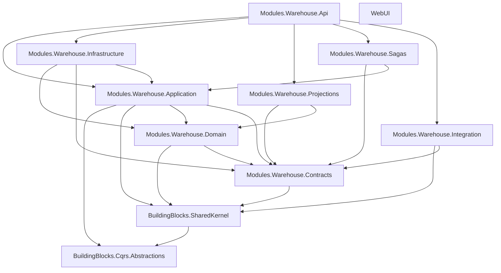

# LKvitai.MES Solution Structure

## Overview

Current solution is organized as a modular monolith with module-scoped projects under `src/Modules/Warehouse` and shared building blocks under `src/BuildingBlocks`.

## Solution Layout

```
src/
├── LKvitai.MES.sln
├── Directory.Build.props
├── global.json
├── docker-compose.yml
├── BuildingBlocks/
│   ├── LKvitai.MES.BuildingBlocks.Cqrs.Abstractions/
│   │   └── LKvitai.MES.BuildingBlocks.Cqrs.Abstractions.csproj
│   └── LKvitai.MES.BuildingBlocks.SharedKernel/
│       └── LKvitai.MES.BuildingBlocks.SharedKernel.csproj
└── Modules/
    └── Warehouse/
        ├── LKvitai.MES.Modules.Warehouse.Api/
        │   ├── LKvitai.MES.Modules.Warehouse.Api.csproj
        │   └── Dockerfile
        ├── LKvitai.MES.Modules.Warehouse.Application/
        │   └── LKvitai.MES.Modules.Warehouse.Application.csproj
        ├── LKvitai.MES.Modules.Warehouse.Contracts/
        │   └── LKvitai.MES.Modules.Warehouse.Contracts.csproj
        ├── LKvitai.MES.Modules.Warehouse.Domain/
        │   └── LKvitai.MES.Modules.Warehouse.Domain.csproj
        ├── LKvitai.MES.Modules.Warehouse.Infrastructure/
        │   └── LKvitai.MES.Modules.Warehouse.Infrastructure.csproj
        ├── LKvitai.MES.Modules.Warehouse.Integration/
        │   └── LKvitai.MES.Modules.Warehouse.Integration.csproj
        ├── LKvitai.MES.Modules.Warehouse.Projections/
        │   └── LKvitai.MES.Modules.Warehouse.Projections.csproj
        ├── LKvitai.MES.Modules.Warehouse.Sagas/
        │   └── LKvitai.MES.Modules.Warehouse.Sagas.csproj
        └── LKvitai.MES.WebUI/
            ├── LKvitai.MES.WebUI.csproj
            └── Dockerfile
```

## Test Layout

```
tests/
├── ArchitectureTests/
│   └── LKvitai.MES.ArchitectureTests/
│       └── LKvitai.MES.ArchitectureTests.csproj
└── Modules/
    └── Warehouse/
        ├── LKvitai.MES.Tests.Warehouse.Unit/
        │   └── LKvitai.MES.Tests.Warehouse.Unit.csproj
        ├── LKvitai.MES.Tests.Warehouse.Integration/
        │   └── LKvitai.MES.Tests.Warehouse.Integration.csproj
        ├── LKvitai.MES.Tests.Warehouse.Property/
        │   └── LKvitai.MES.Tests.Warehouse.Property.csproj
        └── LKvitai.MES.Tests.Warehouse.E2E/
            └── LKvitai.MES.Tests.Warehouse.E2E.csproj
```

## Project Dependency Graph



## Build and Test

```bash
dotnet restore src/LKvitai.MES.sln -p:RestoreForce=true -p:RestoreIgnoreFailedSources=false
dotnet build src/LKvitai.MES.sln -c Release
dotnet test src/LKvitai.MES.sln -c Release
```

## Conventions

- Module projects: `LKvitai.MES.Modules.<Module>.<Layer>`
- Building blocks: `LKvitai.MES.BuildingBlocks.<Concern>`
- Module tests: `LKvitai.MES.Tests.<Module>.<Type>`
- Solution root remains `src/LKvitai.MES.sln`
